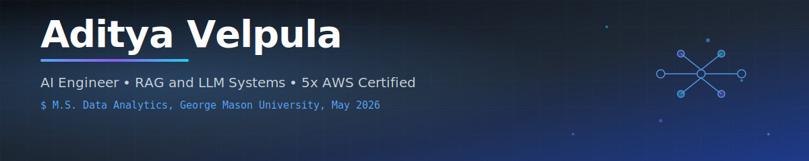

  

---

### 👋 About Me

I'm an **AI Engineer** based in Fairfax, VA, finishing my **M.S. in Data Analytics at George Mason University** (May 2026). I build production RAG systems, LLM orchestration pipelines, and hybrid retrieval engines that ship to real users, not notebooks.

- 🛰️ **Currently leading backend** on [Arctic Policy Assistant](https://github.com/Aditya20029/Arctic-Policy-Assistant), a legal intelligence RAG platform for JAG analysts. Built at the GMU DAPSE 3.0 capstone with NSI (National Security Innovations).
- 🎓 **Graduate Teaching Assistant** for AIT-580 Data Analytics at George Mason, supporting 50+ graduate students.
- 🏅 **5x AWS Certified** including Generative AI Developer Professional and ML Engineer Associate.
- 🛠️ Comfortable across the stack: Python, FastAPI, Docker, React, Next.js, AWS, Postgres, Snowflake.
- ✉️ Reach me at **reachaditya29@gmail.com**.

---

### 🚀 Featured Work

<table>
<tr>
<td width="50%" valign="top">

#### 🛰️ [Arctic Policy Assistant](https://github.com/Aditya20029/Arctic-Policy-Assistant)
Production RAG platform that lets JAG analysts query **1,630 policy sources across 21 countries** in seconds instead of hours.

- Hybrid search engine (SQLite FTS5 + FAISS + Reciprocal Rank Fusion) with authority-weighted reranking
- **nDCG@5 = 0.832**, **Precision@5 = 0.954** on curated eval suite
- 7-stage async LLM orchestration on the OpenAI SDK with checkpoint recovery, per-model circuit breakers, Langfuse observability
- **~80% API cost reduction** by routing simple queries to GPT-5-nano
- Shipped on GMU OpenStack: FastAPI + SSE streaming, Docker behind nginx, token auth, rate limiting
- Validated by **1,481 automated tests**, certified for NSI hand-off

`Python` `FastAPI` `OpenAI` `FAISS` `Docker` `Langfuse` `nginx`

</td>
<td width="50%" valign="top">

#### 🔥 Wildfire Risk Prediction
Geospatial ML pipeline fusing MODIS satellite fire data, NOAA climate variables, and NDVI vegetation indices.

- **AUC-ROC = 0.99** with XGBoost
- GeoPandas risk-zone maps for proactive response

`Python` `XGBoost` `GeoPandas` `MODIS` `NOAA`

#### 📊 SLA Breach Prediction (ITSM Analytics)
End to end ML pipeline over 5,000 synthetic tickets. XGBoost beat baselines for resolution-time and breach prediction. Power BI dashboard with drill-down by priority, assignee, and SLA status.

`Python` `XGBoost` `Scikit-learn` `Power BI`

#### 🌐 Obesity Risk Analytics
Cloud-native pipeline (S3 to Glue to RDS) over CDC BRFSS data. Regression, Random Forest, and ARIMA models to surface county-level obesity trends and socioeconomic risk factors.

`AWS S3` `Glue DataBrew` `RDS` `R` `Python`

#### 🚗 Real-Time License Plate Detection
YOLO localization combined with Tesseract OCR for near-real-time plate extraction across varied formats.

`YOLO` `Tesseract` `OpenCV` `Python`

</td>
</tr>
</table>

---

### 🧰 Tech Stack

**Languages**

**AI / ML and Data Science**

**Backend, Cloud, and Infra**

**Databases and Frontend**

**Tools**

---

### 🏅 AWS Certifications (5x)

Verify any certification at <a href="https://aws.amazon.com/verification">aws.amazon.com/verification</a>

---

### 📈 GitHub Stats

---

### 🎓 Education

| | |
|---|---|
| **George Mason University** | M.S. Data Analytics, 2024 to 2026 |
| **St. Peters Engineering College** | B.Tech CSE (AI and ML), 2020 to 2024 |

---

### 🤝 Let's Connect

📍 Fairfax, VA  •  🟢 Open to AI / ML Engineer roles  •  🛂 F1 STEM OPT Eligible

---

<i>"Build things that ship. Measure what matters. Keep learning."</i>

<!---
Aditya20029/Aditya20029 is a ✨ special ✨ repository because its `README.md` (this file) appears on your GitHub profile.
--->
